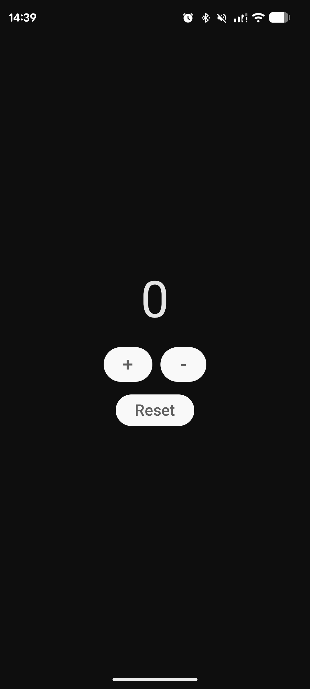

# Number Counter

&nbsp;

&nbsp;

&nbsp;
Click here to get the latest version: &nbsp; 
  
A simple native Android counter app.  

## ☁ Screenshots
Started at 0                                   | Counted to 8
:---------------------------------------------:|:----------------------------------:
             | 

> This app was developed solely by me, you can donate to help me out :)
